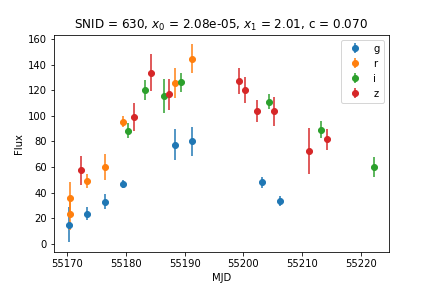
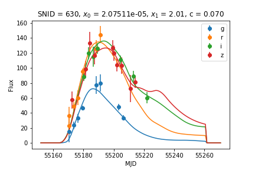
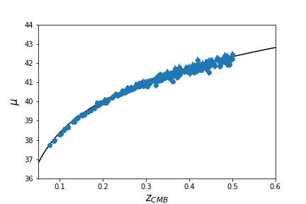

Fitting Light Curves (with SALT2)
=================================

Light curve fitting in SNANA uses the :code:`snlc_fit.exe`
program with a FORTRAN namelist file to provide paramers.
It's easy enough to write, though a bit idiosyncratic
(comments, for example, are exclamation marks).

I'm going to focus on fitting the SALT2 model here,
which is the standard approach for most analyses.
But SNANA can fit light curves using some of the other models
in the :code:`$SNDATA_ROOT/models` directory such as
MLCS and SNooPy, for exampe.

Writing the Namelist (NML) File
-------------------------------

The :code:`snlc_fit.exe` namelist has
three sections.  First, the header section,
which is only really used when running in
batch mode (discussed briefly below).
Next, the :code:`SNLCINP` section,
generally the SN light curve input
parameters and the :code:`FITINP`
section, for the fitting input parameters.

The lines discussed below will be written to
a file called :code:`snfit_PS1.NML`.

The :code:`SNLCINP` section
^^^^^^^^^^^^^^^^^^^^^^^^^^^^

The SNLCINP section is bracketed by::

  &SNLCINP

     ! a bunch of options here
     
  &END

First, some options to find the input
files, the filters, and which LC files to
read in::

     VERSION_PHOTOMETRY = 'PS1MD' ! name of your simulation or real data
     KCOR_FILE          = '../kcor/kcor_PS1.fits' ! kcor file we made earlier

Basic outputs::
  
     SNTABLE_LIST     = 'SNANA FITRES(text:key)' ! this is standard output format
     TEXTFILE_PREFIX  = 'PS1MD' ! output filename (w/o the extension)

Milky Way reddening::

     RV_MWCOLORLAW = 3.1
     OPT_MWCOLORLAW = 99
     OPT_MWEBV = 1

These lines give the value of R_V
for the Milky Way, the Milky Way reddening
colorlaw (99 = Fitzpatrick 1999), and
:code:`OPT_MWEBV = ` means `snlc_fit` will
correct the light curves for MW reddening
before fitting.
     
One :code:`CUTWIN` option::

     CUTWIN_REDSHIFT = 0.02, 1.0

The syntax here is that :code:`CUTWIN_` followed
by any variable can be used to make cuts (min,max)
on the input light curves.

Then there are a few fit options that appear
to not be placed in the :code:`FITINP` section for
reasons I don't totally understand::

     NFIT_ITERATION = 3
     INTERP_OPT     = 1
     ABORT_ON_NOEPOCHS = F
     LDMP_SNFAIL = T

Number of fitting iterations, the interpolation
option (1 = linear interpolation),
avoid aborting just because a SN cannot be
fit, and report the reason for each
SN that fails.
     
The :code:`FITINP` section
^^^^^^^^^^^^^^^^^^^^^^^^^^

Next, the fit options.  Same as before,
the section is denoted with::

  &FITINP
  
     ! a bunch of options

  &END

Then, identify the model and filter set::

    FITMODEL_NAME  = 'SALT2.JLA-B14'
    FILTLIST_FIT = 'griz'
    
This is SALT2.4, from Betoule et al. (2014).  In a perfect
world, you would know this from reading
:code:`$SNDATA_ROOT/models/SALT2/SALT2.JLA-B14/AAA_README`.
However, in this case you'll have to just trust me.

Next, a prior on the time of maximum light and a window
defining the range of rest-frame times (relative to
peak) to include::

    PRIOR_MJDSIG        = 25.0
    TREST_REJECT  = -15.0, 45.0
    
And a few more things::

    LFIXPAR_ALL     = F
    OPT_COVAR = 1
    OPT_COVAR_MWXTERR = 1
    FUDGEALL_ITER1_MAXFRAC = 0.02

These just say, don't fix all the parameters, do
use a model covariance matrix, do use Milky Way
reddening uncertainty in the covariance matrix,
and inflate the uncertainties by 2% for the first fitting iteration
only.

That's it!

Running the Fit
---------------

As simple as::

  snlc_fit.exe snfit_PS1.NML

Analyzing the Output
--------------------

Recent versions of SNANA have cleaned up the
output format a bit so that output files are
easier to parse.  The :code:`FITRES` ASCII format gives 
a line starting with :code:`VARNAMES` that identifies
all the variables and subsequent lines starting with
:code:`SN` for the light curve parameters, metadata,
and covariances.

Plotting light curves with
their corresponding SALT2 fits however, is
not (in my opinion) very intuitive.
I usually resort to `sncosmo
<https://sncosmo.readthedocs.io>`_ and a custom
script (below).

Plotting Light Curve Fits
^^^^^^^^^^^^^^^^^^^^^^^^^

I've included a clumsy python script, :code:`txtobj.py`
for reading FITRES files.  But, it's easy enough to make
your own, or use astropy utilities instead.

To read in the output FITRES file and generate a basic
light curve plot like we had before in the `simulations <simulation.html>`__
guide, first the basic imports::

  import glob
  import os
  import matplotlib.pyplot as plt
  import numpy as np
  from util import snana
  from util.txtobj import txtobj

And then a few lines to read/plot stuff::
  
  fr = txtobj('fitting/PS1MD.FITRES.TEXT',fitresheader=True)

  lcfiles = glob.glob(os.path.expandvars('$SNDATA_ROOT/SIM/PS1MD/*DAT'))
  sn = snana.SuperNova(lcfiles[10])
  for f in sn.FILTERS:
      plt.errorbar(sn.MJD[sn.FLT == f],sn.FLUXCAL[sn.FLT == f],
                   yerr=sn.FLUXCALERR[sn.FLT == f],label=f,fmt='o')
  plt.ylabel('Flux')
  plt.xlabel('MJD')
  plt.legend()

Now add the parameters from the fit::

  iSN = fr.CID == sn.SNID
  plt.title('SNID = %s, $x_0$ = %8.2e, $x_1$ = %.2f, c = %.3f'%(
            sn.SNID,fr.x0[iSN],fr.x1[iSN],fr.c[iSN]))

	    
Now plot the SALT model (you'll need sncosmo for this example)::

  import sncosmo
  from util import register
  
  dust = sncosmo.F99Dust()
  dust.set(ebv=float(sn.MWEBV.split()[0])) # pretty ugly but whatever

  model = sncosmo.Model(source='salt2',effects=[dust],effect_names=['mwebv'],effect_frames=['obs'])
  # NOTE - SNANA SALT2 implementation has a 0.27 mag offset from sncosmo.
  # this doesn't matter at all for most things like cosmology analyses,
  # but certainly matters for making plots
  model.set(z=fr.zHEL[iSN],t0=fr.PKMJD[iSN],
            x1=fr.x1[iSN],c=fr.c[iSN],x0=fr.x0[iSN]*10**(-0.4*(0.27)))

  # register the filters to sncosmo using the kcor file.  sncosmo has
  # pre-canned filter sets but it's best to be safe in a game where mmag
  # offsets matter
  mjd = np.arange(fr.PKMJD[iSN]-40,fr.PKMJD[iSN]+80,1)
  register.from_kcor('kcor/kcor_PS1.fits')
  for i,f in enumerate(sn.FILTERS):

      # careful about zpsys!
      salt2flux = model.bandflux(f, mjd, zp=27.5, zpsys='AB')
      plt.plot(mjd,salt2flux,color='C%i'%i)

      
An important caveat - sncosmo won't check whether your filters
are too red or blue for the SALT2 model.  If your central filter
wavelength in the SN rest frame is redder than 7000 Angstroms or
bluer than 2800 Angstroms then SNANA did not include it in the fit!

Generating Distances and Making a Quick Hubble Diagram
^^^^^^^^^^^^^^^^^^^^^^^^^^^^^^^^^^^^^^^^^^^^^^^^^^^^^^

More sophisticated ways of getting distances are discussed in
the `distances <distances.html>`__ section, but for a small sample it's OK
to use a simpler method.  Namely, plugging light curve
parameters into the Tripp formula and grabbing nuisance
parameters from the latest and greatest cosmological
analysis (at the time of writing, Scolnic et al. 2018).

The Tripp formula (Tripp 1999), to compute distance modulus :math:`\mu`

.. math::
  
  \mu = m_B - M + \alpha \times x_1 - \beta \times c

I'm excluding the mass step for these purposes, as well
as things like bias corrections.  Nuisance parameter M
is approximately -19.36 for :math:`H_0 = 70` km s:math:`^{-1}` Mpc:math:`^{-1}`,
while nuisance parameters :math:`\alpha` and :math:`beta`
are xxx and yyy from the Pantheon analysis (non-bias corrected version).

This is simple in Python, but the errors have to take
the covariances into account.  I included a script :code:`getmu.py`
that does the work.

Making a Hubble diagram is pretty easy then::

  # import our baseline cosmological params for comparison
  from astropy.cosmology import Planck15 as cosmo
  from util import getmu

  # gives the fitres object a "mu", "muerr" and "mures" attribute
  fr = getmu.getmu(fr)
  fr = getmu.mkcuts(fr)
  iErr = fr.muerr < 0.2 # no crazy errors!

  zrange = np.arange(0,1,0.01)
  plt.plot(zrange,cosmo.distmod(zrange).value,color='k')
  plt.errorbar(fr.zCMB[iErr],fr.mu[iErr],yerr=fr.muerr[iErr],fmt='o')
  plt.xlabel('$z_{CMB}$',fontsize=15)
  plt.ylabel('$\mu$',fontsize=15)
  plt.xlim([0.05,0.6])
  plt.ylim([36,44])

Note the SNe fall a little bit below the :math:`\Lambda`\CDM line.  That's ok, it's
just an artifact of :math:`H_0` and the SN absolute magnitude being degenerate.  We
marginalize over this global offset in cosmological analyses.
	   
Done!

Running in Batch Mode
---------------------
Check back later!

Please report any issues with this
guide using the `SNANA_StarterKit GitHub page
<https://github.com/djones1040/SNANA_StarterKit/issues>`_.
