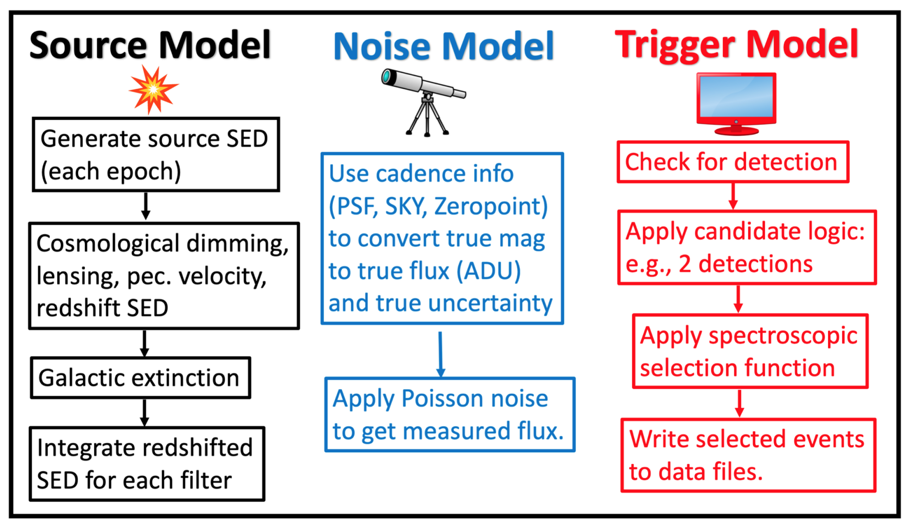
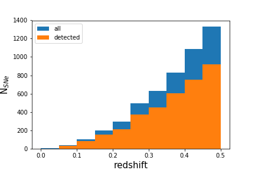
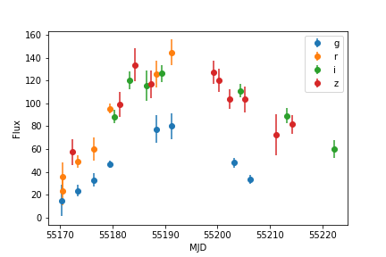

Running a Simple Simulation
===========================

SNANA is an extremely powerful tool for survey
simulations, and can simulate nearly every aspect
of a survey, at least on the catalogue level (not
pixel level) that I can think of.

From Kessler et al. (2019), here's a basic schematic
of the SNANA simulation framework.

Building a SNANA simulation requires at minimum,
four principal files: the `KCOR file <kcor.html>`__,
the :code:`SIMLIB` file, which contains the
sequence of observations to simulate, the :code:`SEARCHEFF`
file that gives the efficiency of SN detection, and finally
the sim-input file which is passed to the simulation
program, `snlc_sim.exe`.
	   
Writing a Simple SIMLIB File
----------------------------

The SIMLIB file defines the parameters of the survey
observations.  At minimum, this requires a list of MJDs,
filters, sky noise, and image zeropoints.  Here is a brief
example for the Pan-STARRS medium deep survey::

  TELESCOPE: PS1
  SURVEY: PS1MD    FILTERS: griz

  BEGIN LIBGEN  2016-3-28
  # --------------------------------------------
  LIBID: 1
  RA: 0    DECL: 0 NOBS: 6 MWEBV: 0.024   PIXSIZE: 0.25
  FIELD: 1
  #                           CCD  CCD         PSF1 PSF2 PSF2/1
  #     MJD      IDEXPT  FLT GAIN NOISE SKYSIG (pixels)  RATIO  ZPTAVG ZPTERR  MAG
  S: 55074.600 0 g 1.0 0.0 6.8691 3.7960 0.0000 0.0000 30.2426 0.0034 -99
  S: 55086.600 1 g 1.0 0.0 10.319 4.4315 0.0000 0.0000 30.1481 0.0034 -99
  S: 55089.600 2 g 1.0 0.0 6.8671 2.8140 0.0000 0.0000 30.2175 0.0036 -99
  S: 55095.500 3 g 1.0 0.0 7.2529 3.9464 0.0000 0.0000 30.3894 0.0041 -99
  S: 55098.500 4 g 1.0 0.0 6.8112 3.3349 0.0000 0.0000 30.1146 0.0040 -99
  S: 55101.600 5 g 1.0 0.0 7.4172 3.1407 0.0000 0.0000 30.1131 0.0037 -99
  END_LIBID: 1
  END_OF_SIMLIB: 1 ENTRIES

The basic syntax here is a short header, where the
:code:`TELESCOPE` and :code:`SURVEY` keys shouldn't have
any impact on the simulated outputs and :code:`FILTERS` is
just the list of one-letter filter names (specified in your
`KCOR file <kcor.html>`__).

Next, there are a couple lines that specify different "libraries" with
the :code:`LIBID` key.  In this case, :code:`LIBID` or :code:`FIELD`
can serve to separate the simulation into distinct groups where simulated
supernovae do not overlap.

The keys :code:`RA`, :code:`DEC`, :code:`NOBS`, :code:`MWEBV`, and
:code:`PIXSIZE` are right ascension, declination, number of
observations, Milky Way E(B-V), and the pixel size of the detector.
In particular, the pixel size of the detector is important for
generating simulations with realistic noise properties.

Now, the observation lines::

  #                           CCD  CCD         PSF1 PSF2 PSF2/1
  #     MJD      IDEXPT  FLT GAIN NOISE SKYSIG (pixels)  RATIO  ZPTAVG ZPTERR  MAG
  S: 55074.600 0 g 1.0 0.0 6.8691 3.7960 0.0000 0.0000 30.2426 0.0034 -99

In order, these fields are the observed MJD, an integer label for
the observation number, the filter, the gain, the CCD noise (I think
this is read noise?) and the RMS of the sky measurements.  Next,
three parameters of the PSF, which are spread in X, spread in Y, and the
ratio of the two.  Those second parameters can be set to 0 and
SNANA will assume a spherically symmetric PSF.

:code:`ZPTAVG` is the image zeropoint and the `ZPTERR` will be
propagated to the observational uncertainties.  :code:`MAG` should
be set to -99 or else SNANA will simulate *only* those specific magnitudes on
a given date.

The Search-Efficiency File
--------------------------

The search-efficiency file defines the probability of detecting a source
as a function of magnitude.  This file is a essentially a two-column
list for one or multiple filters that gives a magnitude and a
probability of detection.  Here's an example::

  PHOTFLAG_DETECT: 4096
  FILTER: g
  SNR:  0.500  0.001
  SNR:  1.500  0.004
  SNR:  2.500  0.028
  SNR:  3.500  0.189
  SNR:  4.500  0.428
  SNR:  5.500  0.644
  SNR:  6.500  0.796
  SNR:  7.500  0.841
  SNR:  8.500  0.949
  SNR:  9.500  0.861
  SNR:  10.500  0.936
  SNR:  11.500  0.956
  SNR:  12.500  0.952
  SNR:  13.500  0.920
  SNR:  14.500  1.000
  SNR:  15.500  1.000
  SNR:  16.500  0.857
  SNR:  17.500  0.933
  SNR:  18.500  1.000
  SNR:  19.500  1.000
  FILTER: r
  SNR:  0.500  0.001
  SNR:  1.500  0.004
  SNR:  2.500  0.025
  SNR:  3.500  0.177
  SNR:  4.500  0.423
  SNR:  5.500  0.593
  SNR:  6.500  0.693
  SNR:  7.500  0.769
  SNR:  8.500  0.878
  SNR:  9.500  0.850
  SNR:  10.500  0.900
  SNR:  11.500  0.871
  SNR:  12.500  0.849
  SNR:  13.500  0.915
  SNR:  14.500  0.969
  SNR:  15.500  0.860
  SNR:  16.500  0.889
  SNR:  17.500  0.952
  SNR:  18.500  0.864
  SNR:  19.500  0.955

:code:`PHOTFLAG_DETECT` is just a value that is added to the simulated
data file to indicate whether or not a given epoch was high enough
SNR to be "detected" in the simulation.

The SEARCHEFF_PIPELINE_LOGIC_FILE
---------------------------------

This one is pretty simple.  The pipeline logic
file tells the simulation what combination of individual
detections in various filters and epochs constitutes a
"detection" for the purposes of the survey.  For example,
detections in two different filters or two separate
detections.

Here are a couple examples.  For a survey that requires two
detections in any one of `griz`::

  PS1MD: 2 g+r+i+z # require 1 epoch, any band

Here's SDSS::
  
  SDSS: 3 gr+ri+gi  # require 3 epochs, each with detection in two bands.

The Sim-Input File
------------------

Finally, the input file!  Starting with the basics::

  GENVERSION: PS1MD         # simname
  GENSOURCE:  RANDOM   
  GENMODEL:   SALT2.JLA-B14
  GENPREEFIX: YSE_IA
  RANSEED: 128473       # random number seed
  
  SIMLIB_FILE: PS1MD_test.simlib # simlib file

  KCOR_FILE:  kcor_PS1.fits

:code:`GENVERSION` is the name of the simulation, :code:`GENSOURCE`
can be set to `RANDOM` or `GRID`.  `GRID` simulations are a whole
thing - let's stick to :code:`RANDOM` (Monte Carlo) simulations.
:code:`GENMODEL` refers to one of the "model" directories in
:code:`$SNDATA_ROOT/models`.

SNANA has kind of a peculiar
way of identifying models.  The first word (before the period)
specifies the model type while the portion after the period
specifies the version.  In this case, :code:`SALT2.B14`
is SALT2.4 from Betoule et al. (2014), but extrapolated to
slightly redder wavelengths than the original model.
The model directory is :code:`$SNDATA_ROOT/models/SALT2/SALT2.JLA-B14`
and some additional information is in the `SALT2.INFO` file in that
directory.  Some models also have README files, which are helpful :).

Onwards!  There are three ways to figure out how many
SNe to simulate (that I'm aware of).  The first is :code:`NGEN_LC`, which
tells the simulation to run until the specified number
of SNe have been detected and pass all cuts.  The second
is :code:`NGENTOT_LC`, which tells the simulation to
run until the specified number of SNe have been simulated
`regardless of whether or not they pass cuts`.
The third option is :code:`NGEN_SEASON` which uses the catalog of
observations, the :code:`SOLID_ANGLE` key , and the SN rates
to figure out how many SNe your survey is expected to observe::

  NGEN_LC: 5000

  APPLY_SEARCHEFF_OPT: 1

  EXPOSURE_TIME_FILTER: g 1.0
  EXPOSURE_TIME_FILTER: r 1.0
  EXPOSURE_TIME_FILTER: i 1.0
  EXPOSURE_TIME_FILTER: z 1.0

  GENFILTERS: griz

  GENSIGMA_SEARCH_PEAKMJD:  1.0 # sigma-smearing for  SEARCH_PEAKMJD (days)

  GENRANGE_PEAKMJD:  55000 56000
  SOLID_ANGLE: 0.192

:code:`APPLY_SEARCHEFF_OPT` set to `1` keeps all
"detected" SNe, but does not require that a SN has
spectroscopic confirmation (:code:`APPLY_SEARCHEFF_OPT = 3`)
or a host galaxy redshift (:code:`APPLY_SEARCHEFF_OPT = 5`)
- those can be specified in more complicated simulations.
:code:`APPLY_SEARCHEFF_OPT = 0` can be used to keep
all SNe, detected or not.

:code:`EXPOSURE_TIME_FILTER` here is set to 1.0, which
just uses the nominal zeropoints, etc specified in the
SIMLIB file.  It can be scaled up or down to easily adjust
simulations.

:code:`GENSIGMA_SEARCH_PEAKMJD` just adds uncertainty
to the time of maximum light reported in the generated
file headers.

Next, referencing the search efficiency files::
  
  SEARCHEFF_PIPELINE_FILE:  SEARCHEFF_PIPELINE_PS1.DAT
  SEARCHEFF_PIPELINE_LOGIC_FILE:  SEARCHEFF_PIPELINE_LOGIC_PS1.DAT

Then, the redshift range to simulate. the redshift
uncertainty to simulate, and the range of time around
maximum light that is simulated for each light curve::
  
  GENRANGE_REDSHIFT:  0.01    0.5
  GENSIGMA_REDSHIFT:  0.000001
  GENRANGE_TREST:   -20.0    80.0     # rest epoch relative to peak (days)

Next, SN rates.  There are a lot of options here, but
for low-`z` simulations a simple power law will suffice::

    DNDZ: POWERLAW  2.6E-5  2.2 # rate=2.6E-5*(1+z)^1.5 /yr/Mpc^3

Here's an alternate example with two power laws from the manual::

  # R0 Beta Zmin Zmax
  DNDZ: POWERLAW2 2.2E-5 2.15 0.0 1.0 # rate = R0(1+z)^Beta
  DNDZ: POWERLAW2 9.76E-5 0.0 1.0 2.0 # constant rate for z>1

And some extra things::
  
  OPT_MWEBV: 1 # simulate galactic extinction from values in SIMLIB file

  # smear flags: 0=off, 1=on
  SMEARFLAG_FLUX:    1  # photo-stat smearing of signal, sky, etc ...
  SMEARFLAG_ZEROPT:  1  # smear zero-point with zptsig

Apply some sample cuts::
  
  APPLY_CUTWIN_OPT:     1
  CUTWIN_NEPOCH:   5 -5.              # require 5 epochs (no S/N requirement)
  CUTWIN_TRESTMIN: -20  10
  CUTWIN_TRESTMAX:   9  40
  CUTWIN_MWEBV:      0 .20
  CUTWIN_SNRMAX:   5.0 griz 2 -20. 80.  # require 1 of griz with S/N > 5

:code:`FORMAT_MASK: 32` specifies FITS format, while :code:`FORMAT_MASK: 2`
is ASCII::
  
  FORMAT_MASK:  2 # terse format

Parameters of the SALT model::
  
  # SALT shape and color parameters
  GENMEAN_SALT2x1:     0.703
  GENRANGE_SALT2x1:   -5.0  +4.0     # x1 (stretch) range
  GENSIGMA_SALT2x1:    2.15  0.472      # bifurcated sigmas

  GENMEAN_SALT2c:     -0.04
  GENRANGE_SALT2c:   -0.4   0.4     # color range
  GENSIGMA_SALT2c:    0.033   0.125     # bifurcated sigmas

Nuisance parameters from the Tripp formula.  Alpha
is the correlation of shape parameter `x1` with distance, while Beta
is the correlation of color parameter `c` with distance.::
  
  # SALT2 alpha and beta
  GENMEAN_SALT2ALPHA:   0.14
  GENMEAN_SALT2BETA:   3.1

Cosmological parameters::

  # cosmological params for lightcurve generation and redshift distribution
  OMEGA_MATTER:  0.3
  OMEGA_LAMBDA:  0.7
  W0_LAMBDA:    -1.00
  H0:            70.0   

And last but not least, variables to "dump" to an output file
for every SN (not just those detected).  The first number is
the number of variables::
  
  SIMGEN_DUMPALL:  10  CID  Z  PEAKMJD S2c S2x1 SNRMAX MAGT0_r MAGT0_g MJD_TRIGGER NON1A_INDEX

The `SIMGEN_DUMPALL` key will save the specified columns for both detected and undetected SNe, while
`SIMGEN_DUMP` will save the information only for detected SNe.  The full example file is available `here`.

Core-collapse and other non-Ia Simulations
^^^^^^^^^^^^^^^^^^^^^^^^^^^^^^^^^^^^^^^^^^

For non-Ia simulations, only a couple things
need to be changed in the input file::

  GENMODEL:   NON1A
  DNDZ: POWERLAW2 5E-5   4.5   0.0   0.8    # rate = R0(1+z)^Beta for z<0.8
  DNDZ: POWERLAW2 5.44E-4  0.0   0.8   9.1  # rate = constant for z>0.8
  DNDZ_PEC1A: POWERLAW  2.6E-5  2.2

  INPUT_FILE_INCLUDE: $SNDATA_ROOT/snsed/NON1A/SIMGEN_INCLUDE_NON1A_J17-beforeAdjust.INPUT

These lines change the generated model, the SN rates (including a new term for peculiar
SNe Ia), and add an input file that defines the contribution of different CC SN
templates.
  
Running the Simulation
----------------------

Now that the files are assembled, running
the simulations is easy::

  snlc_sim.exe sim_PS1.input

The default output is placed in :code:`$SNDATA_ROOT/SIM`.
For your first simulation, you may need to execute
the following command before running the simulation::

  mkdir $SNDATA_ROOT/SIM

Examining the Output
--------------------

Basic properties from the DUMP file
^^^^^^^^^^^^^^^^^^^^^^^^^^^^^^^^^^^

The simulated light curves are located in
:code:`$SNDATA_ROOT/SIM/<genversion/`.  First,
notice the :code:`*.DUMP` file, which contains
the variables specified in the :code:`SIMGEN_DUMP`
variable in your sim-input file.  This is a good
way to get some overview statistics for your sample.

For example, plotting the redshift and peak mag
distribution of your simulation.  Starting with some imports::

  import numpy as np
  import os
  import matplotlib.pyplot as plt
  from txtobj import txtobj

  # read in the DUMP file
  dmp = txtobj(os.path.expandvars('$SNDATA_ROOT/SIM/PS1MD/PS1MD.DUMP'),fitresheader=True)
  print(dmp.__dict__.keys())

Plotting a redshift histogram for detected and undetected SNe::

  bins = np.arange(0,0.55,0.05)
  plt.hist(dmp.Z,label='all',bins=bins)
  plt.hist(dmp.Z[dmp.MJD_TRIGGER != 1000000.000],bins=bins,label='detected')
  plt.ylabel('N$_{SNe}$',fontsize=15)
  plt.xlabel('redshift',fontsize=15)
  plt.legend()

  
Plotting a peak magnitude distribution::

  bins = np.arange(17,25,0.25)
  plt.hist(dmp.MAGT0_r,label='all',bins=bins)
  plt.hist(dmp.MAGT0_r[dmp.MJD_TRIGGER != 1000000.000],bins=bins,label='detected')
  plt.ylabel('N$_{SNe}$',fontsize=15)
  plt.xlabel('redshift',fontsize=15)
  plt.legend()

.. image:: _static/pkmaghist_simtest.png
  
The Simulated Light Curves
^^^^^^^^^^^^^^^^^^^^^^^^^^

Let's take a look at some of the simulated ASCII files.
These can be easily parsed with the `snana.py` script
in the utils directory::

  import numpy as np
  import snana
  import matplotlib.pyplot as plt
  import os
  import glob

  lcfiles = glob.glob(os.path.expandvars('$SNDATA_ROOT/SIM/PS1MD/*DAT'))
  sn = snana.SuperNova(lcfiles[10])
  for f in sn.FILTERS:
      plt.errorbar(sn.MJD[sn.FLT == f],sn.FLUXCAL[sn.FLT == f],
                   yerr=sn.FLUXCALERR[sn.FLT == f],label=f,fmt='o')
  plt.ylabel('Flux')
  plt.xlabel('MJD')
  plt.legend()

In FITS format, things are a little bit more annoying.  Luckily,
the LCs can be converted to a PANDAS dataframe thanks to some
utilities from the PLAsTiCC team and Alexandre Boucaud
(I modified them slightly).

As a reminder, use :code:`FORMAT_MASK: 32` in your sim-input file
to use FITS format and :code:`FORMAT_MASK: 2` for ASCII format.
A quick example for plotting a FITS-format light curve is below::

  from sim_serializer import serialize
  import matplotlib.pyplot as plt
  datadict = serialize.main('PS1MD')
  for key in datadict[list(datadict.keys())[20]].keys():
    if key == 'header': continue
    plt.errorbar(datadict[501][key]['mjd'],
                datadict[501][key]['fluxcal'],
                yerr=datadict[501][key]['fluxcalerr'],
                fmt='o',label=key)
  plt.ylabel('flux')
  plt.xlabel('mjd')

Please report any issues with this
guide using the `SNANA_StarterKit GitHub page
<https://github.com/djones1040/SNANA_StarterKit/issues>`_.
